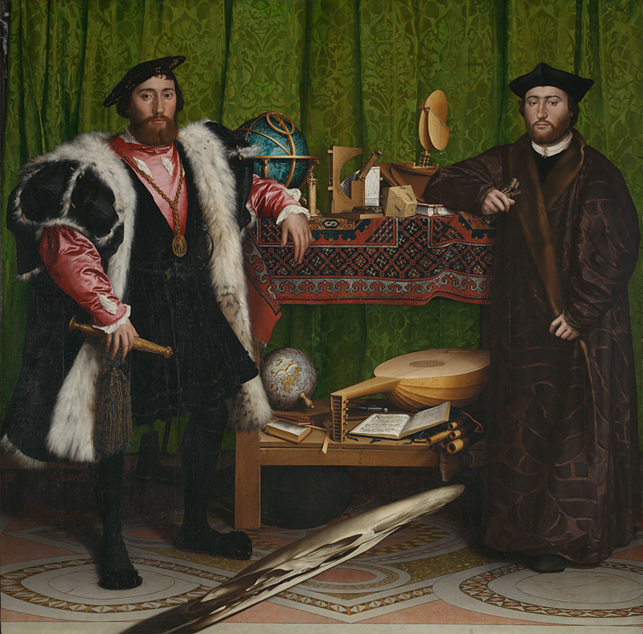

+++
title = "About"
[extra]
footer = ""
+++

 
<figure>

<figcaption>The Ambassadors, by Hans Holbein the Younger.</figcaption>
</figure>
 

Welcome to my blog! My name's Daniel Yu, and I'm currently a PhD student in cognitive science at Brown University. This site is a place where I plan on sharing some of my thoughts about science, philosophy, and life.

If you're interested in keeping up with me, or just looking further into the things I've written about, feel free to check out the links that I've listed <a href="/links">here</a>.

See you around!

